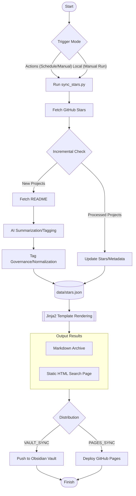

# GitHub Stars Index

English | [中文](README.md)

> Automatically fetch GitHub Stars, generate AI summaries, and make them easily searchable.

## Contents

- [Features](#features)
- [Quick Start](#quick-start)
- [Configuration Reference (Environment Variables / .env)](#configuration-reference-environment-variables--env)
- [Obsidian Sync (Optional)](#obsidian-sync-optional)
- [Local Installation](#local-installation)

---

## Features

- 🤖 **Automatic Sync**: Fetches all starred repositories from your GitHub account.
- 📝 **AI Summaries**: Reads each repository's README and uses AI to generate concise summaries and technical tags.
- 🏷️ **Smart Tagging**: Built-in `TAG_MAPPING` for automatic synonym merging and tech stack normalization (e.g., LLM -> Large Language Model), preventing tag explosion.
- ⚡️ **High Performance**: Supports **concurrency** for AI API calls, significantly speeding up the processing of new projects.
- 🗃️ **Data Driven**: Uses `data/stars.json` at runtime and publishes it to `gh-pages/data/stars.json` for custom development.
- 🎨 **Template Driven**: Uses Jinja2 templates to generate Markdown and static HTML search pages.
- ⏭️ **Smart Incremental Updates**: Uses AI for new projects, while **automatically updating star counts and metadata** for existing ones.
- ⏰ **Automated Workflow**: Regularly runs via GitHub Actions with customizable cron schedules.
- 🔄 **Vault Sync (Optional)**: Automatically pushes generated `stars_zh.md` & `stars_en.md` to your **Obsidian Vault**.
- 🌐 **GitHub Pages (Optional)**: Deploys a static search page with multi-language (ZH/EN) support and real-time search.
- 💻 **Flexible AI Providers**: Compatible with any **OpenAI-format API** (OpenAI, Azure, local Ollama, etc.).

---

## Process Overview



---

## Quick Start

### Step 1: Fork This Repository

Click the **Fork** button in the top right corner to copy this repository to your account.

> [!IMPORTANT]
> This site template includes the `analytics.1step.dev` analytics script with `data-website-id` set to `GitHubStarsIndex`. After forking, change it to your own website ID or remove the script at the bottom of `templates/index.html.j2` so your traffic does not appear in the original project dashboard.

### Step 2: Configure Environment (Choose One)

This project is driven by environment variables. **Priority: GitHub Secrets > .env file**.

#### Method A: Using GitHub Environment Variables (Recommended for continuous running)

Go to **Settings → Secrets and variables → Actions** in your repository:

**🔐 Required Secrets/Variables**
- `GH_USERNAME`: The GitHub username whose stars you want to crawl.
- `AI_API_KEY`: Your AI interface API Key.

**📋 Optional Variables**
These have built-in defaults and usually don't need configuration:
- `AI_BASE_URL`: AI API endpoint (defaults to OpenAI).
- `AI_MODEL`: Model name (defaults to `gpt-4o-mini`).
- `OUTPUT_FILENAME`: Base name for generated files (defaults to `stars`).
- `VAULT_SYNC_PATH`: Save directory in your Vault (defaults to `GitHub-Stars/`).
- `PAGES_SYNC_ENABLED`: Whether to sync to Pages (defaults to `true`).

> [!TIP]
> **About GitHub API Limits**:
> - **Running Online (Actions)**: The workflow automatically injects `GITHUB_TOKEN` with a high limit (1,000 requests/hour), easily handling heavy crawls.
> - **Running Locally**: Without a `GH_TOKEN`, the limit is 60 requests/hour. If you have many stars, it's recommended to add a `GH_TOKEN` to your `.env` to increase the limit to 5,000 requests/hour.

#### Method B: Using a .env File (Best for local development)

1. Copy `.env.example` to `.env` in the root directory.
2. Fill in the required fields in `.env`.

---

### Step 3: Customize Schedule Frequency

Edit `.github/workflows/sync.yml` to modify the `cron` expression:

```yaml
schedule:
  - cron: "0 2 * * 1"  # Example: Run every Monday at 2 AM
```

### Step 4: Manually Trigger the First Run

Go to **Actions → 🌟 GitHub Stars Index 同步 → Run workflow** and click run.

---

## Configuration Reference

| Variable             | Type                     | Description                                   | Default Value               |
| -------------------- | ------------------------ | --------------------------------------------- | --------------------------- |
| `GH_USERNAME`        | Required                 | GitHub username to sync                       | -                           |
| `AI_API_KEY`         | Required                 | AI API Key                                    | -                           |
| `AI_BASE_URL`        | Optional                 | OpenAI-compatible API endpoint                | `https://api.openai.com/v1` |
| `AI_MODEL`           | Optional                 | AI model to use                               | `gpt-4o-mini`               |
| `OUTPUT_FILENAME`    | Optional                 | Base name for generated MD/HTML files         | `stars`                     |
| `VAULT_SYNC_ENABLED` | Optional                 | Whether to enable Obsidian sync               | `false`                     |
| `VAULT_REPO`         | Optional                 | Vault repository (`owner/repo`)               | -                           |
| `VAULT_SYNC_PATH`    | Optional                 | Directory path for Vault sync                 | `GitHub-Stars/`             |
| `PAGES_SYNC_ENABLED` | Optional                 | Whether to deploy to GitHub Pages             | `true`                      |
| `MAX_CONCURRENCY`    | Optional                 | AI concurrency limit (recommended 1-10)       | `1`                         |
| `GH_TOKEN`           | **Strongly Recommended** | Increases API limits to prevent rate-limiting | -                           |

---

## Obsidian Sync (Optional)

This feature allows you to automatically push the generated star summaries to your Obsidian Vault (or any other) GitHub repository, keeping your notes updated automatically.

### Core Mechanism
**Cross-repo sync**: Many Obsidian users use GitHub to store and sync their notes. This project uses the GitHub API to push the generated Markdown files directly to your designated Vault repository.

### Setup Steps

1.  **Prepare Target Repository**: Ensure your Obsidian Vault is already hosted on GitHub.
2.  **Create Personal Access Token (PAT)**:
    - Visit the [Fine-grained PAT configuration page](https://github.com/settings/personal-access-tokens).
    - **Repository access**: Choose "Only select repositories" and select your **Vault repository**.
    - **Permissions**: Under "Repository permissions," set **Contents** to **Read and write**.
    - Once generated, add it to this project's **Settings -> Secrets -> Actions** as `VAULT_PAT`.
3.  **Enable Sync Configuration**:
    - In this project's **Settings -> Variables -> Actions**:
        - Set `VAULT_SYNC_ENABLED` to `true`.
        - Set `VAULT_REPO` to `your-username/repo-name` (e.g., `iblogc/my-obsidian-vault`).
        - Set `VAULT_SYNC_PATH` to the desired folder in your Vault (e.g., `Reading/GitHub-Stars/`).
4.  **Save and Finish**: The next time the Action runs, `stars_zh.md` and `stars_en.md` will automatically appear in your Vault repository.

> [!TIP]
> **How to view locally?**
> Once the remote sync is complete, just use the **Obsidian Git** plugin to "Pull," or run `git pull` in your local vault directory. The latest star summaries will then appear in your note library.

---

## GitHub Pages Deployment (Optional)

This project automatically generates multi-language static web pages with real-time search functionality.

1. Ensure `PAGES_SYNC_ENABLED=true`.
2. After running the Action once, go to **Settings -> Pages**.
3. Select `gh-pages` branch and `/(root)` directory, then click Save.

> [!IMPORTANT]
> **Data Source Migration (Compatibility for Forks)**:
> - The current recommended data source is `gh-pages/data/stars.json`.
> - `data/stars.json` in the `main` branch is only used for initial migration compatibility.
> - Normal runs will no longer commit `data/stars.json` back to the `main` branch.

---

## Docker Deployment

If you want to run this long-term on a server with automatic synchronization, Docker Compose is recommended.

### 1. Configuration
Copy `.env.example` to `.env` and fill in the necessary information:
```bash
cp .env.example .env
# Edit .env to fill in GH_USERNAME, AI_API_KEY, and GH_TOKEN
```

> [!IMPORTANT]
> **GH_TOKEN is Mandatory**: In Docker environments, calling the GitHub API without a token easily triggers [Rate Limiting](https://docs.github.com/en/rest/using-the-rest-api/rate-limits-for-the-rest-api). Configuration increases the limit from 60 to 5,000 requests per hour.

### 2. Start Service
Launch with Docker Compose:
```bash
docker compose up -d
```
This starts two containers:
- `sync`: The core sync script. By default, it runs every **24 hours**. You can adjust this by setting `SCHEDULE_HOURS` in your `.env`.
- `web`: An Nginx-based static server for viewing the generated index.

### 3. Access the Page
Open your browser and visit: `http://localhost:8080`

### 4. Management Commands
```bash
# View sync logs
docker logs -f github-stars-sync

# Run a manual sync immediately
docker compose run --rm sync

# Update page rendering only (skip AI calls)
docker compose run --rm sync --render-only
```

---

## Local Installation

```bash
# Clone the repository and install dependencies
git clone https://github.com/iblogc/GithubStarsIndex.git
cd GithubStarsIndex

# Install dependencies
pip install -r requirements.txt
# Or use uv (recommended)
uv pip install -r requirements.txt

# Configure using .env
cp .env.example .env
# Edit .env and fill in AI_API_KEY and GH_USERNAME

# [Normal Run] Fetch metadata, call AI for summaries, and render pages
python scripts/sync_stars.py
# Or
uv run scripts/sync_stars.py

# [Render Only] Skip fetching/AI, re-render HTML/MD from local stars.json
python scripts/sync_stars.py --render-only
```

---

## File Structure

| File                         | Description                                       |
| :--------------------------- | :------------------------------------------------ |
| `data/stars.json`            | Temporary runtime data (migration entry point)    |
| `templates/`                 | Jinja2 generation templates (Markdown/HTML)       |
| `dist/`                      | Automatically generated local results (HTML / MD) |
| `scripts/sync_stars.py`      | Core sync and generation script                   |
| `.github/workflows/sync.yml` | GitHub Actions scheduled workflow                 |
| `.env.example`               | Configuration example file                        |

---

## Appendix: Applying for a GitHub Token (GH_TOKEN)

To ensure the program can smoothly crawl all your starred repositories, it's recommended to create a Personal Access Token (PAT).

### Steps:
1.  Go to the [GitHub Fine-grained PAT page](https://github.com/settings/personal-access-tokens/new).
2.  **Token name**: `Stars-Index-Sync` (or any name you prefer).
3.  **Expiration**: `90 days` or `Custom` is recommended.
4.  **Resource owner**: Select your personal account.
5.  **Repository access**: Choose `Public Repositories (read-only)` (or `All repositories`).
6.  **Permissions**: No special permissions are required; default public access is enough to fetch your stars list.
7.  Click **Generate token**, then **copy and save** it immediately.
8.  Add this token to the `GH_TOKEN` field in your `.env` file.

> [!TIP]
> If you've enabled **Vault Sync (Obsidian Sync)**, you can reuse the same `VAULT_PAT` (with write permissions) as your `GH_TOKEN`.
